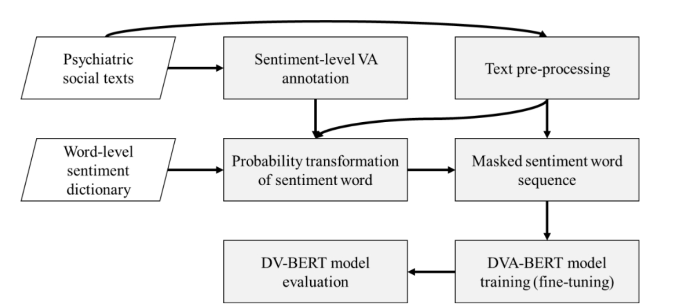

# Sentiment-based masked language modeling for improving sentence-level valence–arousal prediction
Sentiment word masking bert for valence and arousal

## Introduction
This repository contains the code for replicating results from

* [Sentiment-Based-Masked-Language-Modeling-for-Improving-Sentence-Level-Valence-Arousal-Prediction](https://link.springer.com/article/10.1007/s10489-022-03384-9)
* Jheng-Long Wu; Wei-Yi Chung
* Applied Intelligence, 2022

## Flow Chart

## Getting Started

* Build a new virtual environment 
* Install python3 requirements: `pip install -r requirements.txt`
* Run `cd ./Models` to the model folder
* Choose the parameter you want to run in the sh files to train different models
* Train your own models

## Training Insturctions

* Experiment configurations are found in `./Models/*.sh`
* Results model and logs are stored in the corresponding `output` directory under `VA_BERT_mask_sentiment*`.

## Adding Sentiment Words

* Under the `sense_data` folder, that is negative sentiment word and positive sentiment word, you can add the sentiment word to mask it

## Other Insturctions

* `result_statistic` can grep all the prediction result and indicator to the csv file
* `Graph` stores the visul of experimental result from the paper
* `data` contains the experimental data which already split to five fold, the split code and the statistic of masking coverage code is here too
* `notebooks` stores the multilabel regression model and the visulization code

